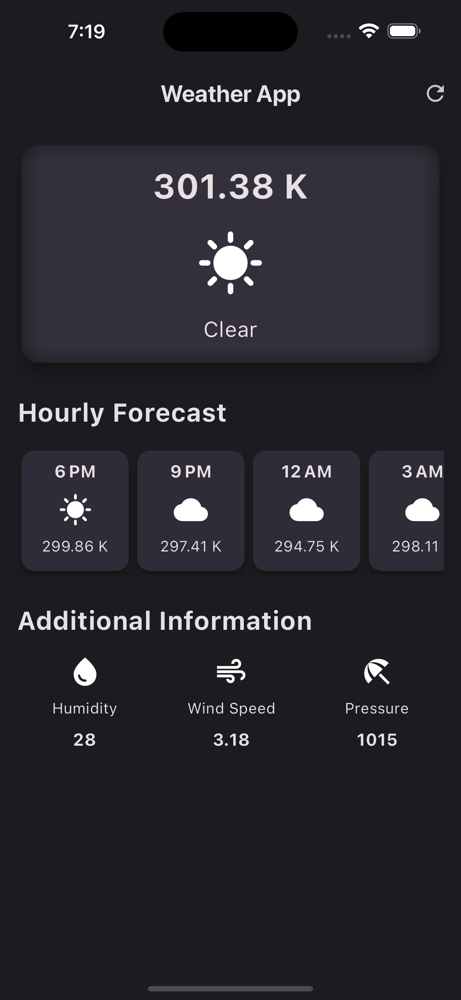
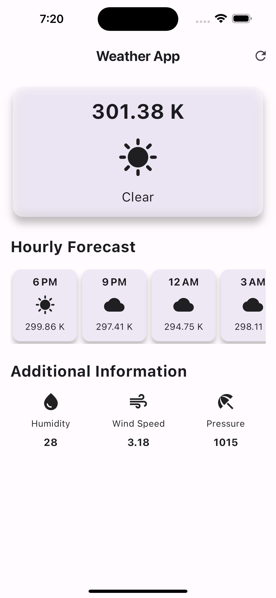

# Weather App

This Flutter application provides real-time weather information and hourly forecasts for a specified location.

## Features

- **Current Weather Display**: View current weather conditions including temperature and sky condition.
- **Hourly Forecast**: Get forecasts for the next few hours to plan your day accordingly.
- **Additional Weather Information**: Access additional details such as humidity, wind speed, and pressure.

## Screenshots

<div style="display: flex; justify-content: space-around;">
  
  
</div>


## Installation

To run this app locally on your machine, follow these steps:

1. **Clone Repository**: Clone this repository to your local machine using the following command:

    ```
    git clone https://github.com/aryanbhardwaj24/weather_app.git
    ```


2. **Navigate to Directory**: Change into the project directory:


    ```
    cd weather_app
    ```


3. **Install Dependencies**: Install required dependencies using the Flutter package manager:


    ```
    flutter pub get
    ```


4. **Run the App**: Launch the app on your local device or simulator:


    ```
    flutter run
    ```


## Usage

Here's how you can use the Weather App:

- **Launch**: Upon launching the app, you will see the current weather information for a default location (Hyderabad, India).
- **Refresh Data**: Tap the refresh button on the app bar to update the weather data.
- **Hourly Forecast**: Scroll horizontally to view the hourly forecast for the next few hours.
- **Additional Info**: Additional weather information such as humidity, wind speed, and pressure is displayed below the hourly forecast weather cards.

## API Key

This app uses the OpenWeatherMap API to fetch weather data. To use this API, you need to provide your API key in the `secrets.dart` file. This file has already been added to `.gitignore` to keep the API key secure.

## License

This project is licensed under the BSD 3-Clause License - see the [LICENSE](LICENSE) file for details.

## Author

[Aryan Bhardwaj](https://github.com/aryanbhardwaj24)

## Acknowledgements

- Icons used in the app are provided by the [Flutter Icon Library](https://icons8.com/).
- Weather data is obtained from the [OpenWeatherMap API](https://openweathermap.org/).


